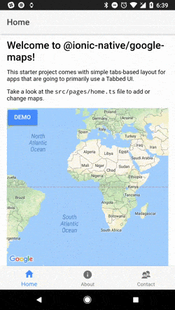

This is a starter template for [@ionic-native/google-maps](https://ionicframework.com/docs/native/google-maps/) plugin.

### With the Ionic CLI:

Take the name after `ionic2-starter-`, and that is the name of the template to be used when using the `ionic start` command below:

```bash
$ sudo npm install -g ionic cordova
$ git clone https://github.com/mapsplugin/ionic-googlemaps-starter-tab
```

Then cd into `myTabs`, and modify the `(REPLACE WITH YOUR APK KEY)` in the `config.xml` and the `package.json` files.

After that, run:

```bash
$ ionic cordova platform add android
$ ionic cordova run android
```


